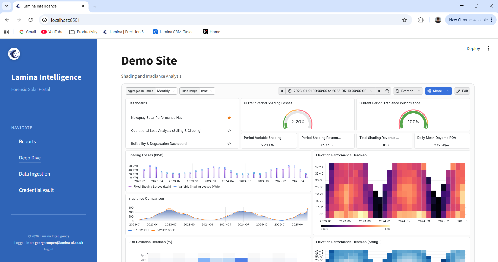

# Lamina Portfolio


This repository showcases the MLOps framework used for building a secure and scalable data solution within the Lamina Energy analytics platform.

**Validation:** <br>
Validated over 2,742 days of 5-minute SCADA telemetry, the Lamina Hybrid Engine identified rising asset degradation trends up to 3 years prior to failure, isolated recoverable revenue losses and OpEx optimisation opportunities.

**Model Validation Report Abstract:** <br>
See [lamina-ml-validation-abstract.pdf](reports/lamina-ml-validation-abstract.pdf) for the executive summary and contents of the Lamina ML model validation report. The full report is available on request.

<br><br>


<br> 
*UI Demo: Integrated Forensic Portal for Portfolio Overview & Site Performance Analysis.*

<br><br>

## System Architecture

### 1. Data Engineering & ETL [```/etl```]
Production-ready, containerised Python ETL pipeline for solar energy data analytics. Highlights include:
- Docker containerisation for reproducible deployments
- Orchestrated pipeline with flexible configuration
- Weather data ingestion and temporal alignment
- Data validation, transformation, and merging
- Batch writing to InfluxDB with retry logic

See [etl/README.md](https://github.com/GeorgeCooper-WT/lamina-etl-portfolio/blob/main/etl/README.md) for details.

<br>

### 2. Infrastructure as Code [```/terraform```]
Terraform infrastructure-as-code for a scalable AWS data lake architecture. Features include:
- Multi-bucket S3 structure for raw, processed, and report data
- Lifecycle and cost optimisation policies
- Secure IAM, encryption, and secrets management

```
terraform/
├── main.tf           # Root orchestration
├── variables.tf      # Global configuration
├── outputs.tf        # Global outputs
├── lambda/           # Source code for AWS Lambda functions
└── modules/          # Encapsulated, reusable infrastructure
    ├── data-lake/    # S3 Tiering & Lifecycle policies
    ├── iam/          # Least-privilege role definitions
    ├── secrets/      # AWS Secrets Manager integration
    └── lambda/       # Infrastructure definitions for compute
```

See [terraform/README.md](https://github.com/GeorgeCooper-WT/lamina-etl-portfolio/blob/main/terraform/README.md) for details.

<br>

---

**Note:** This portfolio is intended for demonstration and code review purposes. No proprietary data or credentials are included.
