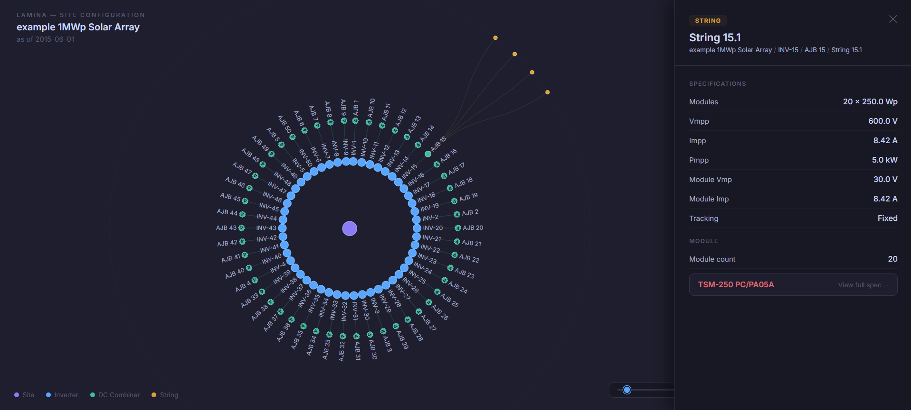

# Lamina Intelligence: Forensic Solar Analytics

<br>

> **Repository Scope & IP Notice**
>
> *This repository showcases the engineering framework behind the Lamina Intelligence platform, covering data infrastructure, ML methodology, and applied LLM/VLM document parsing. The code in this repository > represents the initial MVP and pipelines intended for general code review.*
>
> *Since this MVP, the platform has evolved significantly within the VLM parsing section. The updated VLM parsing architecture has scaled to handle dense 100MWp+ SLD diagrams utilising a broader tech stack (OCR, > OpenCV etc.) alongside BOMs to create a centralized SQL database. This platform is currently maintained as proprietary IP and excluded from this portfolio snapshot.*

<br>

**Validation:** <br>
Validated over 2,742 days of 5-minute SCADA telemetry, the Lamina Hybrid Engine identified rising asset degradation trends up to 3 years prior to failure, isolated recoverable revenue losses and OpEx optimisation opportunities.

**Model Validation Report Abstract:** <br>
See [lamina-ml-validation-abstract.pdf](reports/lamina-ml-validation-abstract.pdf) for the executive summary and contents of the Lamina ML model validation report. The full report is available on request.

<br>

<p align="center">
  
  <br>
  <em>UI Demo: Integrated Forensic Portal for Portfolio Overview & Site Performance Analysis.</em>
</p>

<br>

## System Architecture

### 1. Data Engineering & ETL ```/etl```
Production-ready, containerised Python ETL pipeline for solar energy data analytics. Highlights include:
- Docker containerisation for reproducible deployments
- Orchestrated pipeline with flexible configuration
- Weather data ingestion and temporal alignment
- Data validation, transformation, and merging
- Batch writing to InfluxDB with retry logic

See [etl/README.md](https://github.com/GeorgeCooper-WT/lamina-etl-portfolio/blob/main/etl/README.md) for details.

<br>

### 2. Infrastructure as Code ```/terraform```
Terraform infrastructure-as-code for a scalable AWS data lake architecture. Features include:
- Multi-bucket S3 structure for raw, processed, and report data
- Lifecycle and cost optimisation policies
- Secure IAM, encryption, and secrets management

```
terraform/
├── main.tf           # Root orchestration
├── variables.tf      # Global configuration
├── outputs.tf        # Global outputs
├── lambda/           # Source code for AWS Lambda functions
└── modules/          # Encapsulated, reusable infrastructure
    ├── data-lake/    # S3 Tiering & Lifecycle policies
    ├── iam/          # Least-privilege role definitions
    ├── secrets/      # AWS Secrets Manager integration
    └── lambda/       # Infrastructure definitions for compute
```

See [terraform/README.md](https://github.com/GeorgeCooper-WT/lamina-etl-portfolio/blob/main/terraform/README.md) for details.

<br>

### 3. ML Model & Analytics
*Note: The core ML modeling codebase is proprietary and has been omitted from this public repository. This section outlines the technical framework and validation methodology.*

<br>

**Tech Stack:** 
<br>Python (XGBoost, Scikit-learn, NumPy, Pandas, SHAP)

**Physics Modelling:** 
<br>Baseline performance modelled using PVLib to integrate theoretical physical constraints e.g. clear-sky and diffuse irradiance curves.

**Decomposition Logic:** 
<br>Utilises a hybrid approach to separate reversible losses (soiling/shading) correlations from irreversible degradation trend-lines.


**Technical Highlights:**
- Benchmarked against 8 years of high-fidelity meteorological data with a baseline fidelity of 98.7% R<sup>2</sup>
- Identified string-level signatures of degradation up to 3 years prior to failure utilising rolling volatility analysis of the Performance Index (PI)
- Leverages the RMSE delta (0.11 vs 0.25) between filtered and unfiltered datasets as a mathematical proxy for recoverable yield loss
- Validated via 5-fold rolling-origin cross-validation to maintain temporal integrity and prevent data leakage

<br>

*Detailed validation report available upon request. See [lamina-ml-validation-abstract.pdf](reports/lamina-ml-validation-abstract.pdf) for the executive summary.*

<br>

### 4. Document Intelligence & Site Configuration ```/vlm_parser```

*Note: Prompts and proprietary code are omitted from this public repository.*

<br>

VLM/LLM pipeline for automated solar site configuration. Ingests raw Single Line Diagrams and Bills of Materials, extracts structured component data via modular per-component vision extractors, and populates a queryable SQLite database enriched with manufacturer spec sheet data.

<br>

> **Status: Work in Progress (Scaling for 100MWp+)**
> The current pipeline is functional for residential and commercial-scale SLDs (~1MWp). Currently scaling the architecture to handle the information density of utility-scale CAD drawings (100MWp+).
>
> To solve for VLM context window size, and the high density of large-scale CAD SLDs:
>
> - OCR Text Extraction: Moving away from VLM exclusive inference by introducing an OCR pre-processing layer; this grounds the LLM with high-accuracy text extractions to improve data reliability.
> - Image Segmentation: Implementing automated image segmentation, breaking down complex SLDs into classified chunks. This enables a tighter context focus, reduced token usage, and greater VLM accuracy and consistency.

<br>

**Evaluation:**
- Field-level accuracy measured against manually verified ground truth JSON using a recursive leaf-node diff framework
- Current error rate ~1% (constrained to small-scale SLDs)
- Pipeline is currently overfit to a small set of initial test SLD annotation styles

<br>

<p align="center">
  
  <br>
  <em>Interactive site configuration viewer: Site → Inverter → DC Combiner → String hierarchy with full spec sheet drill-down.</em>
</p>

<br>

See [vlm_parser/README.md](vlm_parser/README.md) for methodology, before/after visuals, and folder structure.

<br>

---

**Note:** This portfolio is intended for demonstration and code review purposes. No proprietary data or credentials are included.
